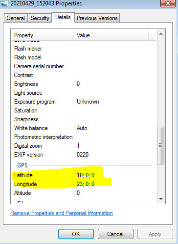
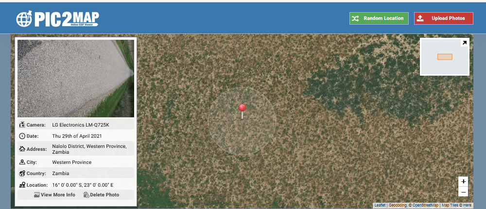
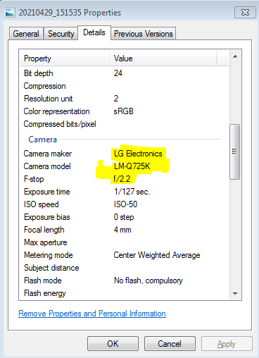
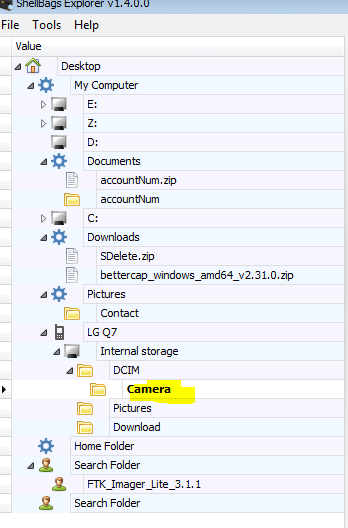

I will try to run walk-through using simple methods not with indepth tools.

Tools Used 
  - 7-Zip 32 bit
  - Notepad++ 32 bit
  - Forensic 7z plugin https://www.tc4shell.com/en/7zip/forensic7z/
  - Eric Zimmerman's Tools
  - Prefetch Viewer from NirSoft Forensic Tools
  - DB Browser for SQLite
  - DCode Tool https://www.digital-detective.net/dcode/
  

Just extract the zip file using 7-zip or your preffered zip tools and verify the check sum.

Since I am usng old latop which can't be instaled with FTK or some other disk forensics tool, I prefer to working with alternate tools which works on my Win 7 32 bit machine.

As discussed earlier I will be using Forensic 7z Plug-in for extracting ad1 image (tc4shell has tutorial how to install plugin).

This respective challenge was designed to recall couple of techniques for investigator on below topics
* Browser Forensics
* Prefetch Forensics
* ShellBags 
* LOLBins


Lets walk-through one by one

Lets Unzip c48-Africanfalls.zip


## 1	What is the MD5 hash value of the suspect disk? 
Once you extract the zip file we can verify the checksum/md5 using couple of md5 tools or else we can find the txt file DiskDrigger.ad1.txt which contains the information about ad1 file

```
Created By AccessData® FTK® Imager 4.5.0.3 

Case Information: 
Acquired using: ADI4.5.0.3
Case Number: 
Evidence Number: 
Unique Description: 
Examiner: 
Notes: 


[Computed Hashes]
 MD5 checksum:    9471e69c95d8909ae60ddff30d50ffa1
 SHA1 checksum:   167aa08db25dfeeb876b0176ddc329a3d9f2803a

Image information:
 Acquisition started:   Tue Jun 15 12:28:20 2021
 Acquisition finished:  Tue Jun 15 12:33:10 2021
 Segment list:
  D:\Users\Mawso3a\Desktop\DiskDrigger.ad1

Image Verification Results:
 Verification started:  Tue Jun 15 12:33:18 2021
 Verification finished: Tue Jun 15 12:33:51 2021
 MD5 checksum:    9471e69c95d8909ae60ddff30d50ffa1 : verified
 SHA1 checksum:   167aa08db25dfeeb876b0176ddc329a3d9f2803a : verified

```
```diff
+ Flag : 9471e69c95d8909ae60ddff30d50ffa1
```
<hr>

## 2	 What phrase did the suspect search for on 2021-04-29 18:17:38 UTC? (three words, two spaces in between) 
As Question itself indicates that user activity which he tried to search for something suspicious.

we can aqcuire information from browser artificats, before that we may need to get some information about what all are browsers been installed with in provided image file.

Lets get into the image for installed 
browser aplications.

We can achive by examining Regsity or access the respective ProgramFiles/ProgramData Folder (but here in this challenge we have very minimal set of folders acquired for investigation).

Lets Concentrate on Regsity using Eric Zimmerman's Registry Explorer (no luck since we have not found any registry information form given image artifacts)

Lets examine the AppData Folder **Users\John Doe\AppData\Local**

```
Volume in drive D has no label.
 Volume Serial Number is 76BE-5B39

 Directory of D:\CD\66\DiskDigger\DiskDrigger\001Win10.e01_Partition 2 [50647MB]_NONAME [NTFS]\[root]\Users\John Doe\AppData\Local

18-06-2021  18:10    <DIR>          .
18-06-2021  18:10    <DIR>          ..
26-04-2021  00:14    <DIR>          BraveSoftware
30-04-2021  06:15    <DIR>          FileZilla
30-04-2021  00:06    <DIR>          Google
28-04-2021  23:15    <DIR>          Microsoft
               0 File(s)              0 bytes
               6 Dir(s)  34,210,144,256 bytes free

```

On AppData we found that user machine is instaled with **Brave Browser** along with **Chrome**

Lets examine Chrome artifacts for user browsing activity by accessing Chrome Preference file.

*Chrome stores the history of visited sites in a file named History. This file uses the SQLite database format. The History file can be found in same location as the Preferences file. There is also Archived History that predates information in the History file. Note that the Archived History only contains visits.* for more information https://forensicswiki.xyz/wiki/index.php?title=Google_Chrome or https://www.foxtonforensics.com/browser-history-examiner/chrome-history-location

Lets Open Chrome artifacts (SQLite) File and export **keyword_search_terms** table where we can able to view the flag for time last accessed *13264193858900891* (Use DCode Tool)


```diff
+ Flag : password cracking lists
```

<hr>

## 3	 What is the IPv4 address of the FTP server the suspect connected to? 

Its wasn't be a tricky question if you look for Q2 which we already  have some information about aplications been installed with respective image, Lets try to find instaled apps usnig different techniques (AppData), where can able to find the FileZilla app.

Lets examine Filezilla artifacts **User\John Doe\AppData\Roaming\FileZilla\filezilla.xml**


```diff
+ Flag : 192.168.1.20
```

## 4	 What date and time was a password list deleted in UTC? (YYYY-MM-DD HH:MM:SS UTC) 

Deleted ?? lets examine $ReCycle.Bin folder for the deleted files usnig **RBCmd Tool from EZTools** 

Check for **/$Recycle.Bin/S-1-5-21-3061953532-2461696977-1363062292-1001/"**

Where we can able to find the find 

```diff
+ Flag : 2021-04-29 18:22:17 UTC
```


## 5	 How many times was Tor Browser ran on the suspect's computer? (number only) 

Prefetch files are temporary files stored in the System folder name as a prefetch. Prefetch is a memory management feature. The log about the frequently running application on your machine is stored in the prefetch folder. The log is encrypted in Hash Format so that no one can easily decrypt the data of the application. These files can be used to extract timestamp and other resources consumed when the file executes.

Lets examine the prefect folder using couple of freely avaiable tools like as WinPrefectchView from NirSoft or PEcmd.exe

Prefetch folder are avaiable in **\root\Windows\Prefetch** where we have file name with **TORBROWSER-INSTALL-WIN64-10.0-F3C4DF19.pf** file 


```diff
+ Flag : 0
```

## 6	 What is the suspect's email address? 

Again we need to look into browser artifacts since we haven't found anything related to mail clients with in the given image.

Check History related to "mail.protonmail.com". The email address is "dreammaker82@protonmail.com".

```diff
+ Flag : dreammaker82@protonmail.com
```

## 7	 What is the FQDN did the suspect port scan? 

Lets check for the command line history snice the given image host is WIN64-10 let examine the power shell command line history usnig from Users AppData

artifacts location **Users/John Doe/AppData/Roaming/Microsoft/Windows/PowerShell/PSReadLine/ConsoleHost_history.txt**

```
bettercap
bettercap --check-updates
bettercap -S
bettercap -X --no-spoofing
bettercap -version
bettercap -eval "caplets.update; ui.update; q"
bettercap -caplet http-ui
ipconfig
nmap -Sp 10.0.2.15
nmap -Sp 10.0.2.1-254
nmap -sP 10.0.2.1-254
ping 10.0.2.2.
ping 10.0.2.2
exit
sdelete
ipconfig
ipconfig /cleardns
ipconfig /flushdns
exit
sdelete
exit
ipconfig /flushdns
ping dfir.science
nmap dfir.science
dir
cd .\Documents\
dir
sdelete .\accountNum
sdelete .\accountNum.zip
exit
cd E:\FTK_Imager_Lite_3.1.1
& '.\FTK Imager.exe'
exit
```

```diff
+ Flag : dfir.science
```

## 8	 What country was picture "20210429_152043.jpg" allegedly taken in? 
Pictures ?? Lets examine Pictures folder under User John Doe for picture **"20210429_152043.jpg"**



```
Latitude : 16; 0; 0
Longitude : 23; 0 ;0
```

Lets search the coordinates usnig Gmaps which it will the location of the image.

or lets upload image to  https://www.pic2map.com/  get the location of the image since it has meta data (you can use exfil tool both commandline or website to get the same data)



```diff
+ Flag : Zambia
```

## 9	 What is the parent folder name picture "20210429_151535.jpg" was in before the suspect copy it to "contact" folder on his desktop? 
After extracting metadata, The photo was taken by LG mobile phone.



Since picture was taken from mobile LG Mobile LM-Q725K 

Lets Check the ShellBags artifacts from **\Users\John Doe\AppData\Local\Microsoft\Windows\Usrclass.dat**

lets get this load to ShellBagsExplorer 



```diff
+ Flag : Camera
```

## 10	 A Windows password hashes for an account are below. What is the user's password? Anon:1001:aad3b435b51404eeaad3b435b51404ee:3DE1A36F6DDB8E036DFD75E8E20C4AF4::: 

I have tried all these with my internal crack station usnig John

```diff
+ Flag : AFR1CA!
```

## 11	 What is the user "John Doe's" Windows login password? 

Try usnig https://hashes.com/en/decrypt/hash

```diff
+ Flag : ctf2021
```