I will try to run walk-through using simple methods not with indepth tools. 

Before that we need to recall couple of filters usnig Wirehark. Below are couple of cheetsheets which are available freely online.
 
  - https://packetlife.net/media/library/13/Wireshark_Display_Filters.pdf
  - https://www.comparitech.com/net-admin/wireshark-cheat-sheet/
  - https://stationx-public-download.s3.us-west-2.amazonaws.com/Wireshark-Cheat-Sheet-v1.pdf

Tools Used 
  - 7-Zip 32 bit
  - Notepad++ 32 bit
  - NetworkMiner Free Edition https://www.netresec.com/?page=networkminer
  - DCode Tool https://www.digital-detective.net/dcode/
  - Couple of Online tools
	* qacafe previously known as CloudShark
	* https://www.cloudshark.org/captures/b801ff6bc08a
  

Just extract the zip file using 7-zip or your preffered zip tools and verify the check sum.

I prefer to working with alternate tools which works on my Win 7 32 bit machine.

This respective challenge was designed to recall couple of techniques for analyst on below topics
* PCAP Forensics
* Wireshark Filters


Lets walk-through one by one

Since its a 3rd part of the challenge for AfricanFalls which is on-going blue team challenge lets keep it simple.

Lets Unzip c50-AfricanFalls3.zip, after unziping the file we have got PCAP File **UNODC-GPC-001-003-JohnDoe-NetworkCapture-2021-04-29.pcapng**

Lets Open PCCANG file with well know Pcap anayzer WireShark

## PCAP Information
```
File

Name:
C:\Users\TheCortex\Desktop\tmp\c50-AfricanFalls3\UNODC-GPC-001-003-JohnDoe-NetworkCapture-2021-04-29.pcapng
Length:
38MB
Hash (SHA256):
3cc2061959afb116aeedce2736809f28236b96e20b89b4199194f4a30a0802ba
Hash (RIPEMD160):
e278720f93a6d58b45d1614877eb92b91ef0a684
Hash (SHA1):
0a40bcf2c2329ddf72bd864f05855314cb76514d
Format:
Wireshark/... - pcapng
Encapsulation:
Ethernet

Time

First packet:
2021-04-30 06:30:51
Last packet:
2021-04-30 06:38:21
Elapsed:
00:07:30

Capture

Hardware:
Intel(R) Core(TM) i7-10510U CPU @ 1.80GHz (with SSE4.2)
OS:
Linux 5.4.0-72-generic
Application:
Dumpcap (Wireshark) 3.2.3 (Git v3.2.3 packaged as 3.2.3-1)

Interfaces

Interface
Dropped packets
Capture filter
Link type
Packet size limit
wlo1
0 (0.0%)
none
Ethernet
262144 bytes

Statistics

Measurement
Captured
Displayed
Marked
Packets
45024
45024 (100.0%)
—
Time span, s
450.467
450.467
—
Average pps
99.9
99.9
—
Average packet size, B
821
821
—
Bytes
36965483
36965483 (100.0%)
0
Average bytes/s
82k
82k
—
Average bits/s
656k
656k
—
```


<hr>

## 1	 What is the FTP password? 

Filter for FTP traffic >> Follow FTP Stream

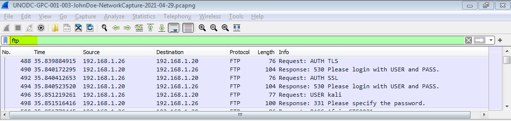

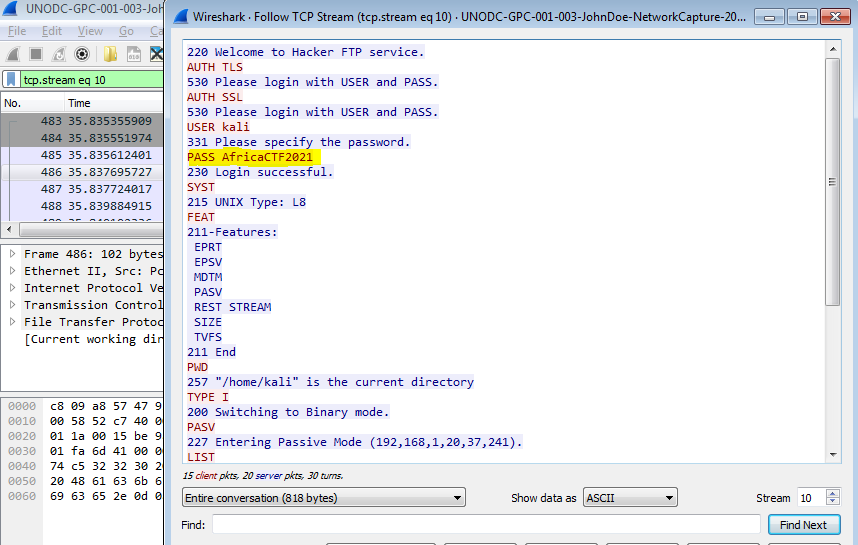

```diff
+ Flag : AfricaCTF2021
```
<hr>

## 2	  What is the IPv6 address of the DNS server used by 192.168.1.26? (####::####:####:####:####) 

To analyze UDP DNS traffic: Observe the traffic captured in the top Wireshark packet list pane. To view only UDP traffic related to the DHCP renewal, type udp. port == 53 (lower case) in the Filter box.

Let's load capture file to anayze the DNS traffic, Since we are looking for the DNS server at 192.168.1.26 first let we look for the DNS server for the current capture. DNS Servce run on port 53 with UDP Protocol and we will filter the traffic for port & IPv6.

let Look for the actual UDP Traffic from Statistics Menu >> Conversations >> UDP Tab and Check for **Limit to dislpay filter**


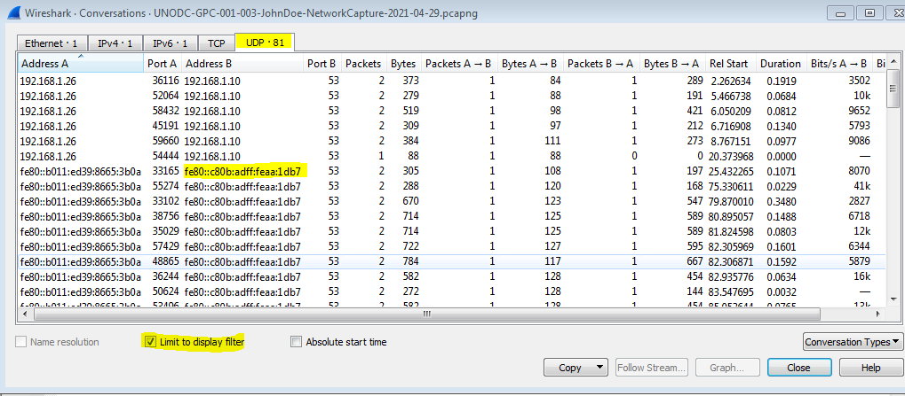
 
from above image we came to know there is IPv6 DNS traffic server from fe80::b011:ed39:8665:3b0a towards to fe80::c80b:adff:feaa:1db7


```diff
+ Flag :   fe80::c80b:adff:feaa:1db7
```

<hr>

## 3	 What domain is the user looking up in packet 15174? 

Let Goto to packet 15174 by Ctrl+G where it will ask you for Packet number where you want to go or else you can use filter "frame.number == 15174"

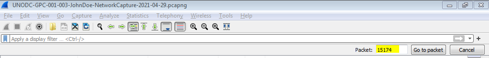

or else you can use filter "frame.number == 15174"

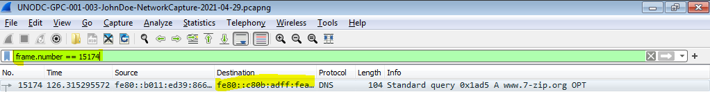

for Packet 15174 its was IPv6 DNS request for www.7-Zip.org

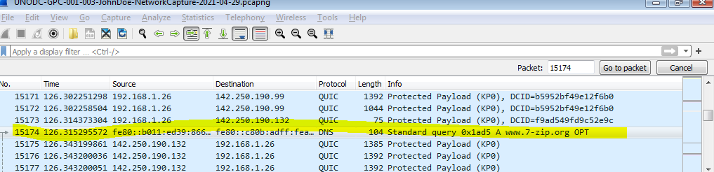

```diff
+ Flag : www.7-zip.org
```

## 4	  How many UDP packets were sent from 192.168.1.26 to 24.39.217.246? 

Let look into the PCap file to know about the total count of packets, just re call couple of display filters in Wireshark usnig below references.
 - https://wiki.wireshark.org/DisplayFilters
 - https://www.wireshark.org/docs/dfref/u/udp.html

Lets use "udp" filter to show udp packets only where it display filtered packets with count #2137 out of total packets 45024 

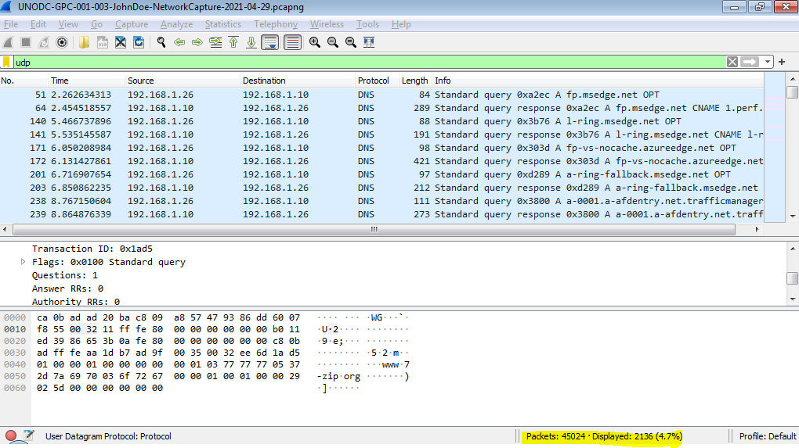

Lets get down to the required filter "ip.src == 192.168.1.26 && ip.dst == 24.39.217.246" to filter required packets only

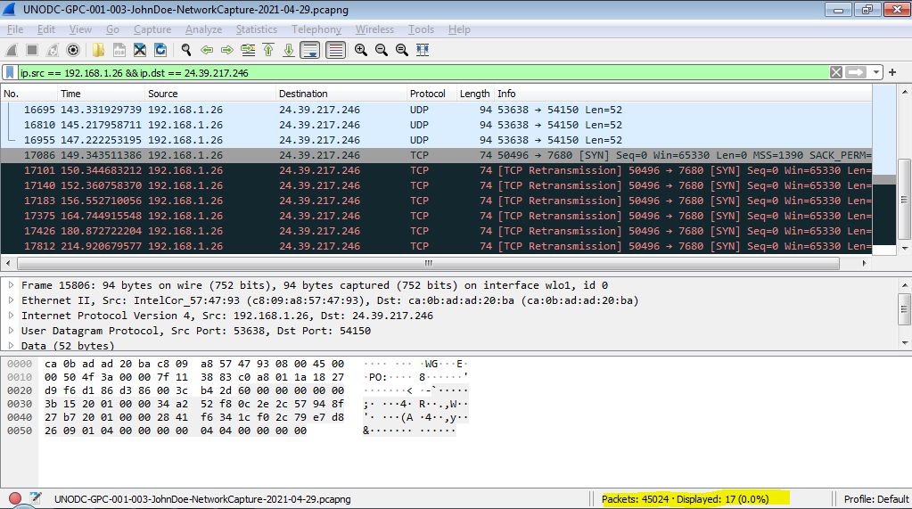

Since we have got both TCP and UDP packets let filter for only UDP which we have got only 10 conversations btw 192.168.1.26 to 24.39.217.246

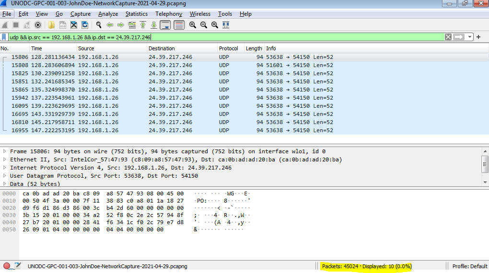


```diff
+ Flag : 10
```


## 5	 What is the MAC address of the system being monitored? 

Lets analyze pcap in Wireshark as we know the suspect IP is 192.168.1.26, check Packets with SRC IP 192.168.1.26 aqnd check the SRC MAC address of any packet

Just use the filter ip.src==192.168.1.26 and we have total number of 34038 packets for the source 192.168.1.26

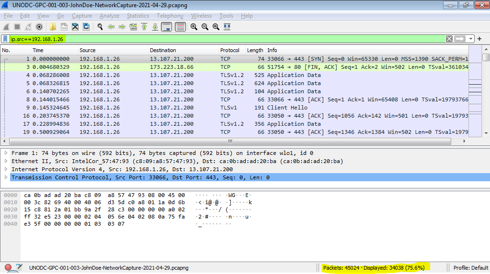

Lets examine IP header for the packet src ip 192.168.1.26

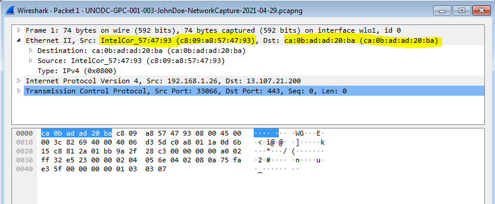


```diff
+ Flag : c8:09:a8:57:47:93
```

## 6	 What was the time when the picture 20210429_152157.jpg was taken on the 29th of April? (hh:mm:ss) 

Its look like a simple tricky to find out the extact time of the captured images 20210429_152157.jpg.

we can use "frame contains" filter lets try our luck with filter "frame contains 20210429_152157"

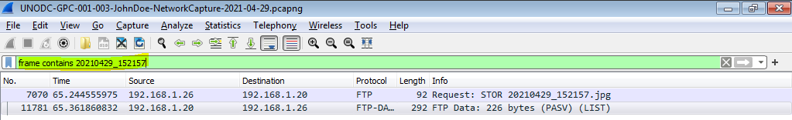

or else we can use filter "ftp-data" along with Search for Image Strings 20210429_152157.jpg

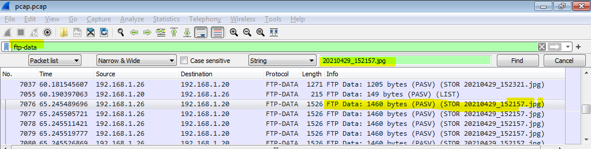

Let Examine the packet which has exif data of file 20210429_152157.jpg

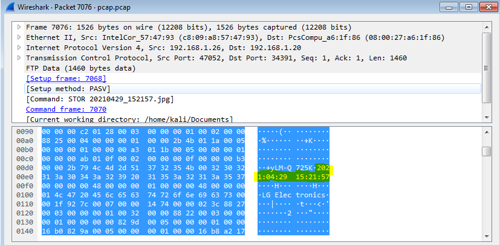

```
'¦È	¨WGEè@@ªöÀ¨À¨·ÌWDÃÒÓ¿ÿY
úñç§AN¾cÿØÿáExifMM*
	2iÂ(%+K£«³+yLM-Q725K2021:04:29 15:21:57HHLG Electronics|t<'2"°¸¢ÀÇÎ
Õ	¤Ý +-*Ý
*ñ¤*ù 0¤+
+ @¤+ £
+%0220 0100ÐuÃ>^áÂ>zE@@ÜÊÀ>VÉ>¨E@@@¬÷ò> A@«Á>ÊÀ>@zE@@RCXí??(Z÷??ìQx?7ô>'þ?Ñ,?¸£Ï>A?zzzzzzzzzzz  0  0ffabZÒ1`# ¡ |ÀàÀ@0`aòz 22aN+`p+`Pò¶@ÿ+` ò¶@ÿ+`@qpò¶@ÿ+`Ppò¶@ÿ+`Pò¶@ÿ+`@@ò¶ÿ+aG¡0Pò¶ÿ)áQ±@òÿ)¡bP°ò 
ÿ*Ub`0ò¶ ÿ,Aa¢`òÒ ÿ.a¢pòÒû0ÿ/Aa¢ 0£ 
:.!_³   0¥*Ña¢
Rû00¥
```
its has answer which 2021:04:29 15:21:57

```diff
+ Flag : 15:21:57
```

## 7	 What is the server certificate public key that was used in TLS session: da4a0000342e4b73459d7360b4bea971cc303ac18d29b99067e46d16cc07f4ff? 

Analyze pcap in Wireshark, For TLS 1.2 with filter "tls" and search for 'da4a0000342e4b73459d7360b4bea971cc303ac18d29b99067e46d16cc07f4ff' string in packet details


```diff
+ Flag : 04edcc123af7b13e90ce101a31c2f996f471a7c8f48a1b81d765085f548059a550f3f4f62ca1f0e8f74d727053074a37bceb2cbdc7ce2a8994dcd76dd6834eefc5438c3b6da929321f3a1366bd14c877cc83e5d0731b7f80a6b80916efd4a23a4d
```

## 8	  What is the first TLS 1.3 client random that was used to establish a connection with protonmail.com? \

As per available details with pcap protomail.com resolves ip address 185.70.41.35 let search for filter "ip.dst==185.70.41.35 && tls"

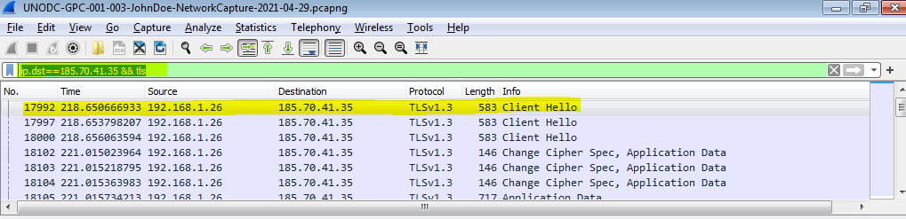

the first packet with number 17992 is initiated client hello with protonmail.com, let examine for the fild random number used for the TLS 1.3

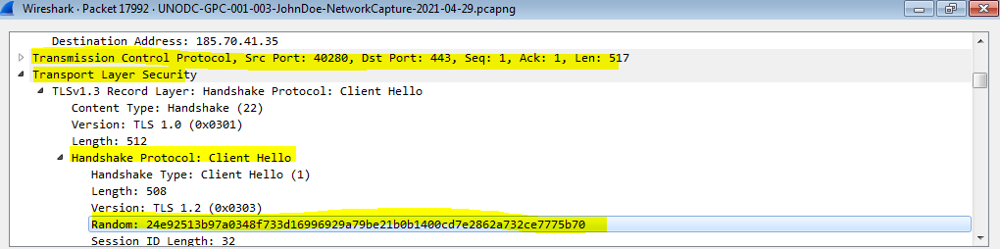

```diff
+ Flag : 24e92513b97a0348f733d16996929a79be21b0b1400cd7e2862a732ce7775b70
```

## 9	  What is the first TLS 1.3 client random that was used to establish a connection with protonmail.com? 

```diff
+ Flag : 
```

## 10	  What time was a non-standard folder created on the FTP server on the 20th of April? (hh:mm) 

```diff
+ Flag : 
```

## 11	  What domain was the user connected to in packet 27300? 

```diff
+ Flag : 
```